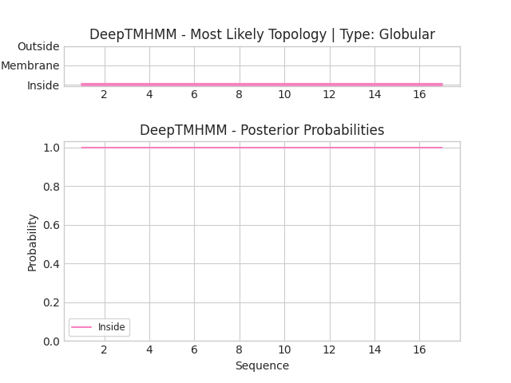

## DeepTMHMM - Predictions
Predicted topologies can be downloaded in [.gff3 format](TMRs.gff3) and [.3line format](predicted_topologies.3line)

You can download the probabilities used to generate this plot [here](Type:_probs.csv)
### Predicted Topologies
```
>Type: | GLOB
IINEPTAAAIAYGLDKK
IIIIIIIIIIIIIIIII

```


```
##gff-version 3
# Type: Length: 17
# Type: Number of predicted TMRs: 0
Type:	inside	1	17				

```
