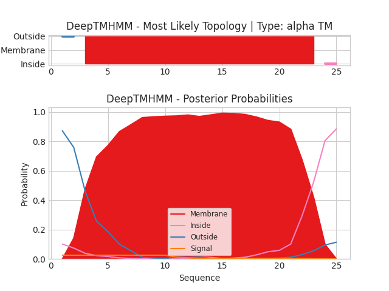

## DeepTMHMM - Predictions
Predicted topologies can be downloaded in [.gff3 format](TMRs.gff3) and [.3line format](predicted_topologies.3line)

You can download the probabilities used to generate this plot [here](Type:_probs.csv)
### Predicted Topologies
```
>Type: | TM
GTLMELGISPIVTSGMVMQLLAGSK
OOMMMMMMMMMMMMMMMMMMMMMII

```


```
##gff-version 3
# Type: Length: 25
# Type: Number of predicted TMRs: 1
Type:	outside	1	2				
Type:	TMhelix	3	23				
Type:	inside	24	25				

```
