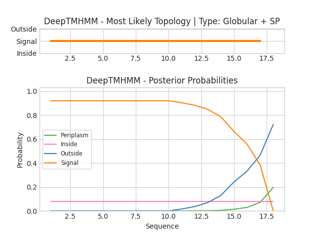

## DeepTMHMM - Predictions
Predicted topologies can be downloaded in [.gff3 format](TMRs.gff3) and [.3line format](predicted_topologies.3line)

You can download the probabilities used to generate this plot [here](Unnamed_probs.csv)
### Predicted Topologies
```
>Unnamed | SP
EQLIDILATSALIHEDIR
SSSSSSSSSSSSSSSSSO

```


```
##gff-version 3
# Unnamed Length: 18
# Unnamed Number of predicted TMRs: 0
Unnamed	signal	1	17				
Unnamed	outside	18	18				

```
